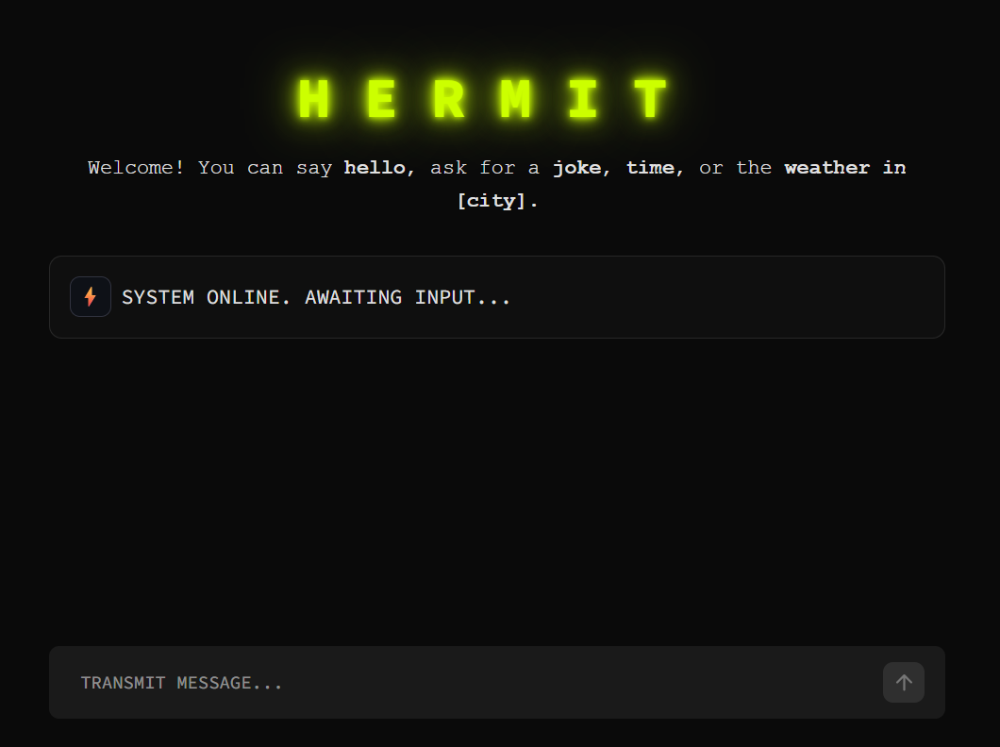

# CodeAlpha_Basic-Chatbot: H E R M I T

H E R M I T is a simple, rule-based conversational chatbot written in Python. It's designed to respond to basic greetings, answer simple questions, tell jokes, solve advanced mathematical queries, and fetch the current weather and time anywhere in the world!



This project was built as part of the **CodeAlpha Internship**.

## Features

- **Basic Conversation:** Responds to greetings, farewells, and inquiries about its identity or capabilities.
- **Weather Information:** Fetches real-time weather data for a specified location (or your current location) using the `wttr.in` service.
- **Global Time Check:** Tells you the current local time, or the time in any specified location using the `timeapi.io` API.
- **Mathematical Engine:** Evaluates standard calculations (`2 + 2 * 4`) and solves advanced symbolic/scientific mathematical expressions (`sin^2(A) + cos^2(A)`) using the `sympy` library. No prefixes required—just type your math!
- **Entertainment:** Can tell you a programming joke.

## Prerequisites

- Python 3.x installed on your system.
- An active internet connection (required for the weather and time APIs).
- Dependencies listed in `requirements.txt`.

## Installation & Usage

1. Clone this repository or download the source code.
2. Open your terminal or command prompt.
3. Navigate to the directory containing the script.
4. Install the required dependencies:
   ```bash
   pip install -r requirements.txt
   ```
5. Run the chatbot using the following command:

   ```bash
   python chatbot.py
   ```

6. Start chatting! You can try typing queries like:
   - *"Hello"*
   - *"What is your name?"*
   - *"Weather in London"*
   - *"What time is it in Tokyo?"*
   - *"sin^2(x) + cos^2(x)"*
   - *"calculate 25 * 4.5"*
   - *"Tell me a joke"*
   - *"Quit"* or *"Bye"* to exit.

## Code Structure

- `start_chat()`: Initializes the chat loop and handles user input/output.
- `get_bot_response(user_input)`: Core logic that parses the user's text and determines the appropriate response based on keywords.
- `get_weather(location)`: Helper function that reaches out to the `wttr.in` API to get current weather conditions.
- `get_time(location)`: Helper function that uses `timeapi.io` and `wttr.in` to parse timezones and fetch accurate current times.
- `calculate_math(expression)`: Uses `sympy` and heuristic parsing to securely solve implicit and explicit mathematical formulas.

## Author

Created by **Ashish Kumar** (as part of the CodeAlpha Internship).
